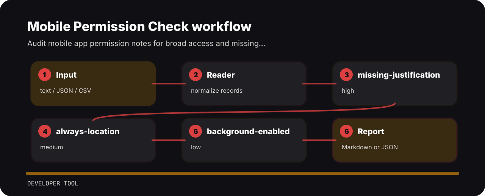

# Mobile Permission Check

| Detail | Value |
| --- | --- |
| Area | developer tool |
| Entry | `mobile-permission-check` |
| Input | plain text |
| Output | terminal findings, optional JSON |

## Review notes

- `missing-justification` - permission justification missing (high); state user-facing reason.
- `always-location` - always location permission requested (medium); prefer when-in-use if possible.
- `background-enabled` - background behavior enabled (low); verify need and disclosure.


## Review path



## Local check

```bash
git clone https://github.com/mertefekurt/mobile-permission-check.git
cd mobile-permission-check
python -m pip install -e ".[dev]"
mobile-permission-check examples/sample.txt
```
