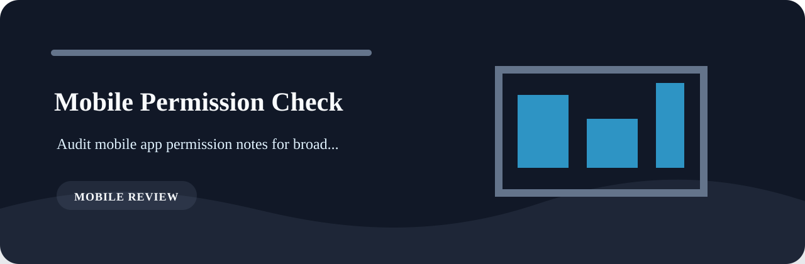

# Mobile Permission Check

Audit mobile app permission notes for broad access and missing justification.

## First impression



When this tool reports something, I want the finding to be boringly explicit: what matched, how severe it is, and what a reviewer should clean up.

## Tripwires

- `missing-justification` (high): permission justification missing. Fix: state user-facing reason.
- `always-location` (medium): always location permission requested. Fix: prefer when-in-use if possible.
- `background-enabled` (low): background behavior enabled. Fix: verify need and disclosure.

## Runbook

```bash
git clone https://github.com/mertefekurt/mobile-permission-check.git
cd mobile-permission-check
python -m venv .venv
source .venv/bin/activate
python -m pip install -e ".[dev]"
```

Then:

```bash
mobile-permission-check examples/sample.txt
mobile-permission-check examples/sample.txt --json
```

## Development note

The policy lives in `rules.py`; parsing and rendering stay separate so the rule list is easy to audit.
